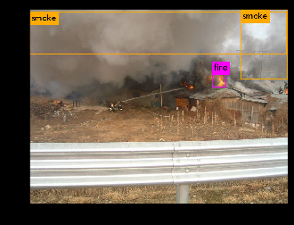
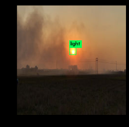
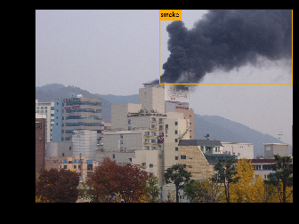

# Yolo v3를 이용한 화재 감지 
### 국민대학교 2019 -2 팀팀Class( 인공지능 + CRM )의 일환으로 진행된 프로젝트 입니다. 
##### FBI ( Fire Briefly Inform ) 팀의 결과물 입니다.
###### darknet에 빌드되어 있는 yolo v3를 사용했습니다. https://github.com/AlexeyAB/darknet 

    
    
    

_____
    
#### 1) 목표
    - CCTV를 이용한 화재 조기 검출을 통한 공공 안전 증진
___  
#### 2) 사용한 DataSet -----> [FBI_Dataset](https://drive.google.com/drive/folders/18XdaSXy1fpRShrVdex5ZqOESjGOw6PeH)
      
   직접 유튜브나, 구글검색을 통해 데이터를 모아 라벨링 (Bound Box) 작업을 한 데이터 입니다.    
     
   Fire,Smoke,Light의 세 가지 Class로 구성되어 있습니다.
____   
#### 3) 사용한 Weight -----> [FBI_weights](https://drive.google.com/file/d/10stsLIqEkM5b8nl2bIHceB7SDD4_iBcQ/view?usp=sharing)
  
  화재 관련 Decection 을 할 때 유용하게 사용 가능합니다.
____  
#### 4) 사용한 Notebook -----> [Yolo_v3_custom Train 한국어 튜토리얼](https://colab.research.google.com/drive/14QiNQNBXXcsViFZ6MEhFSLQ62GZmMivR)
    
  Darknet이 OpenCV,CUDA 버전에 민감하고, 대부분의 코드가 Linux 커맨드이므로 Colab 사용을 권장드립니다.  
    
  Yolo v3 custom Training 관련 한국어 튜토리얼을 찾기 힘들어 공유합니다.
____  
  

문제 시 연락 부탁드립니다
kcg99kr@kookmin.ac.kr
